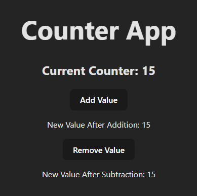

# HOOKS

Hooks are built in features of REACT. We can use them accordingly. Hooks are used to accomplish a single objective, however we can combine different hooks as well. We can create our own hooks as well.

## Some Common Pre-Built HOOKS

- State Hooks
- Context Hooks
- Ref Hooks
- Effect Hooks
- Performance Hooks

These will be studies later during a project. Right now we will only focus on State Hooks.

### State Hooks

- In React, state is a way to store and manage dynamic data in a component (the function which returns jsx to render).
- Dynamic data is the data that can change over time, like user input, counters, API responses, etc.
- To add a state to a react component we use Use State
- Syntax:

  ```js
  import { useState } from "react";

  const MyComponent = () => {
    const [state, setState] = useState(initialValue);

    // ...return <> </>
  };
  ```

  - First we need to import useState from react
  - MyComponent funtion is the one that is to be rendererd
  - _state_ is the variable
  - _setState_ is a function that is used to update the _state_ variable.
  - _useState(initialValue)_ is the default state. We can enter anything here.

## Why use State-Hooks

Consider the app below:

- we have a counter app which has 2 buttons: Increase counter and decrease Counter.
- We have to display the updated counter at 3 places; current counter, near add Value button and near Remove Value Button
  

  #### Traditional DOM Manipulation method

  - We will update the counter, upon clicking add value or remove value.
  - Then we will have to select all the elements which needs to be updated, one by one and update those.
  - If we do not do this, our backend will update the values, but it will not be displayed on the UI.
  - This is where React comes in, it helps us with maintaining UI.

  ```js
  let counter = 15;

  function addValue() {
    counter = counter + 1;

    document.getElementById(
      "currentCounter"
    ).innerHTML = `Current Counter: ${counter}`;

    document.getElementById(
      "addNewValue"
    ).innerHTML = `New Value After Addition: ${counter}`;
  }

  function removeValue() {
    counter = counter - 1;
    console.log(counter);

    document.getElementById(
      "currentCounter"
    ).innerHTML = `Current Counter: ${counter}`;

    document.getElementById(
      "subtractNewValue"
    ).innerHTML = `New Value After Addition: ${counter}`;
  }

  return (
    <>
      <h1>Counter App</h1>
      <h2 id="currentCounter">Current Counter: {counter}</h2>
      <button onClick={addValue} id="addValue">
        Add Value
      </button>
      <p id="addNewValue">New Value After Addition: {counter}</p>

      <button onClick={removeValue} id="decreaseValue">
        Remove Value
      </button>
      <p id="subtractNewValue">New Value After Subtraction: {counter}</p>
    </>
  );
  ```

  - Notice how we have to select all the elements that we needed to update.
  - Its a hassle. Suppose our app is too big and to update all those elements by selecting them one by one, it will be a nightmare.

### Maintaining Dynamic Variables using use-state and REACT

- REACT gives us the concept of states. We will manage the values of backend and react will automatically search for all the variables that needs to be updated and do it for us.

```js
function App() {
  let [count, setCount] = useState(5); // set the default value of state to 5
  let counter = count;

  function increaseValue() {
    counter = count + 1;
    setCount(counter); // we call setCount method to update the count
  }

  function decreaseValue() {
    counter = count - 1;
    setCount(counter); // we call setCount method to update the count
  }

  return (
    <>
      <h1>Chai aur REACT</h1>
      <h2>Counter Value: {counter}</h2>
      <button onClick={increaseValue}>Increase Value</button>
      <br />
      <button onClick={decreaseValue}>Decrease Value</button>
    </>
  );
}
```

- It makes our life so easy.
