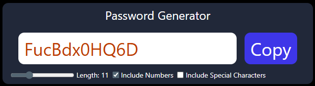

# 6.

# useCallback, useEffect and useRef hooks

## Objective

- create a password generator
- The user should be able to copy the password using a copy button.
- The app must include:
  - a length bar slider, which will the user can slide to adjust the length of the password
  - a checkbox to include Numbers
  - a check box to include Special character

### Key details:

- The app does not reload after any change in length and checkboxes.
- It generates the password in real time.
- **_It means, there must be a function, that automatically runs in the background whenever there is a change in length or checkboxes._**

### Screenshot



# Solution:

#### Key points to approach the project

- To track the length of the password, we will use **_useState_** hook.
  - because, length is a variable which will be used to process our problem and it also has to reflect in the UI.
- Similarly, include number and include special character will be a state as well.
- generated Password is also a state, because it changes and it reflects in the UI.

#### setting up states in App.jsx

- So, in our app.jsx we will write this

  ```jsx
  function App() {
    const [length, setLength] = useState(5); // default value of password length is 5

    // useState for checkboxes. Default is a boolean false.
    const [numberAllowed, setNumberAllowed] = useState(false);
    const [charAllowed, setCharAllowed] = useState(false);

    // useState for password.
    // Default is empty string.
    // because we'll generate the password and set it as soon as our app loads.
    const [password, setPassword] = useState("");
  }
  ```

#### useCallback Hook

- Now we will write a function to generate password.
- Here, we know that this function will automatially run as soon as the app loads.
- This function runs again, whenever there is change in length.
- This function runs again, whenever there is change in checkboxes.
- to achieve this, there are two components to it:
  - 1. we will have to use **_useCallback_** hook to **store** the function in **cache everytime** there is a change in length or checkboxes.
  - 2. we will use **_useEffect_** hook to **run** the function **everytime** there is a change in length or checkboxes.
- **_useCallback is hook that let us cache (memoize) a function so it doesn't get created on every render-unless its dependencies change._**
- To use this hook, we pass a function and its dependecies in the hook

  ```js
  import { useCallback } from "react";
  const cachedFunction= useCallback(fn,[dependency1, dependency2, ...])
  // where fn is function definition
  // dependencies are stored in array.
  // "fn" will memoize everytime there is any change in the dependencies.
  ```

- now, using useCallback to generate password

  ```jsx
  const passwordGenerator = useCallback(() => {
    let pass = "";
    let str = "ABCDEFGHIJKLMNOPQRSTUVWXYZabcdefghijklmnopqrstuvwxyz";
    const splChar = "!@#$%^&*-_=+";
    const num = "0123456789";

    if (numAllowed === true) {
      str = str + num;
    }

    if (splCharAllowed === true) {
      str = str + splChar;
    }

    // here, the value of length is determined by the slider
    for (let index = 1; index <= length; index++) {
      let randomNumber = Math.floor(Math.random() * str.length + 1);
      pass = pass + str.charAt(randomNumber);

      setPassword(pass); // sets the password using useState hook.
    }
  }, [length, numAllowed, splCharAllowed, setPassword]);

  // the array are the dependencies.
  // the above function will memoize everytime there is a change in the dependencies.
  ```

  - Now, to the function is cached everytime when the dependency change.
  - By doing this, we have created an optimized way to run the function.

#### useEffect Hook

- Now, we want our function to run everytime there is a change in its dependencies.
- for this, we use **_useEffect_** hook.
- In React, if a function updates a state, we should not call it directly like a regular function inside the component body.
- Why? Because React re-renders the component every time the state changes.
- function runs → updates state → triggers re-render → function runs again → ...

- To avoid this infinite loop, we will use **_useEffect hook._**

  ```jsx
  useEffect(() => {
    passwordGenerator();
  }, [length, numAllowed, splCharAllowed, setPassword]);

  // where, passwordGenerator is the function to be executed.
  // arrays are the dependencies.
  // Therefore, passwordGenerator runs everytime when there is a change in dependencies.
  ```

#### Copy button functionality

- to create the copy functionality, we will use **_useRef_** hook.
- useRef is a tool in React that lets you:
  - Access HTML elements directly (like an input box).
  - Store a value that doesn’t reset or cause re-render when changed.
- useRef is like a hidden box that React ignores.
- It’s perfect for things you want to remember but not show on screen or trigger UI changes.
- using useRef hook

  ```jsx
  // to pass a reference of an element, inside that element we will create a field like this.
  // Check the UI section of the code.
  // Inside the input element, we will write ref={passwordRef}.
  // This will link the element to our variable using useRef.

  const passwordRef = useRef(null);

  // copy function
  const copyToClipBoard = () => {
    passwordRef.current?.select(); // highlights the copied text.
    // we used useRef here to get the reference and show it to user what is selected.
    window.navigator.clipboard.writeText(password);
    // this window object is only available in react on PC.
    // it is not available on server side code.
  };
  ```

#### UI for the project

```jsx

// password text box
<input
  type="text"
  value={password}
  className="bg-white outline-none py-3 px-3 rounded-xl"
  placeholder="password"
  readOnly
  ref={passwordRef}
/>

// copy button
<button
  className="outline-none bg-blue-700 text-white px-3 py-3 shrink-0 rounded-xl"
  onClick={copyToClipBoard}
  >
  Copy
</button>

// length slider
<input
  type="range"
  min={6}
  max={25}
  value={length}
  className="cursor-pointer"
  onChange={(e) => {
      setLength(e.target.value);
      }}
/>
<label>Length: {length}</label>

// numbers Allowed checkbox
<input
  type="checkbox"
  defaultChecked={numAllowed}
  id="numberInput"
  onChange={() => {
      setNumAllowed((prev) => !prev);
      }}
/>

// special characters Allowed checkbox

<input
  type="checkbox"
  defaultChecked={splCharAllowed}
  id="splCharacterInput"
  onChange={() => {
      setSplCharAllowed((prev) => !prev);
      }}
/>
<label>Include Special Characters</label>

```

## Important Distinction

- useCallback is used to **CACHE** the method everytime the dependency changes.
- useEffect is used to **RUN** the method everytime the dependency changes.
- they are both different things, not be confused with each other.
- useCallback here is just to optimize the function execution.
